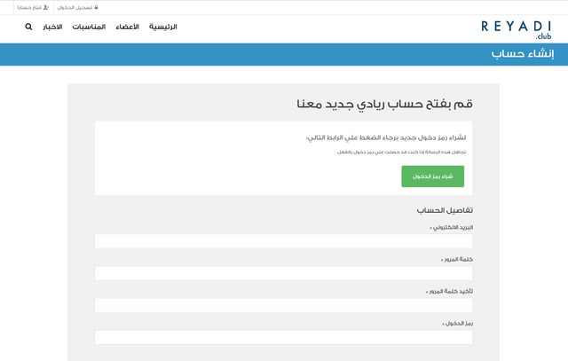
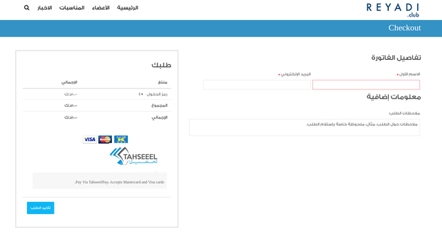

# BuddyPress vs WooCommerce vs Tap Payment. Customization included:

- registration of the user after purchasing of the register code in Tap system;
- an ability to generate the authorization codes and give them to users for free;
- customization of default WooCommerce and BuddyPress features such as filters and actions;
- addition of extra fields to BuddyPress registration form.

Note: green button is the one which allows the user to purchase the code to activate the registration.

